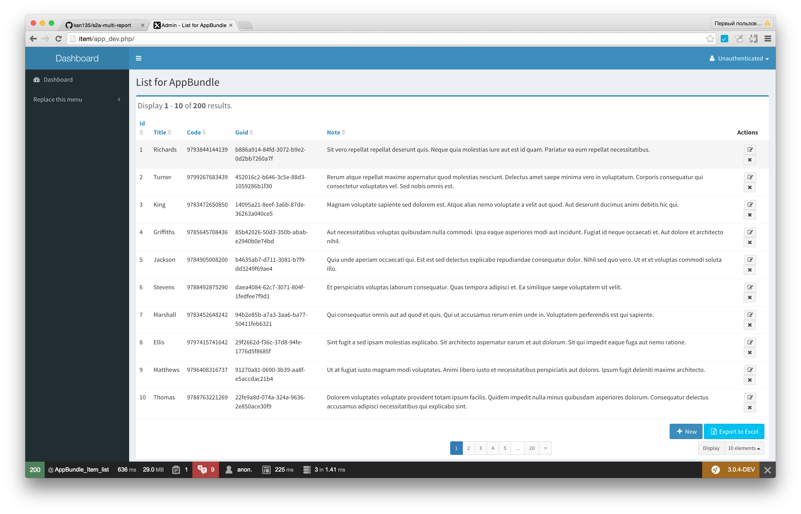

Test multi-report excel builder
===============================

A Symfony project created on March 3, 2016, 9:22 pm.

See https://github.com/symfony2admingenerator/GeneratorBundle/issues/262

First step. Simple multi-report. 
--------------------------------
There are still no GUI, no credentials or other parameters merging as we discuss before in #262 .

It auto-generates routes for each export key (if key is not found use defaults). 
*  /excel
*  /excel/full
*  /excel/short
*  /excel/simple

Please, add download buttons to UI manualy. 

Simple YAML config (only columns, it's cover 99% of my needs FOR NOW):
```yaml
    excel:
        params: 
            export: 
               full:
                -       id
                -       title
                -       code
                -       guid
                -       note
               short:
                -       id
                -       code
                -       title
               simple:
                -       title
```

